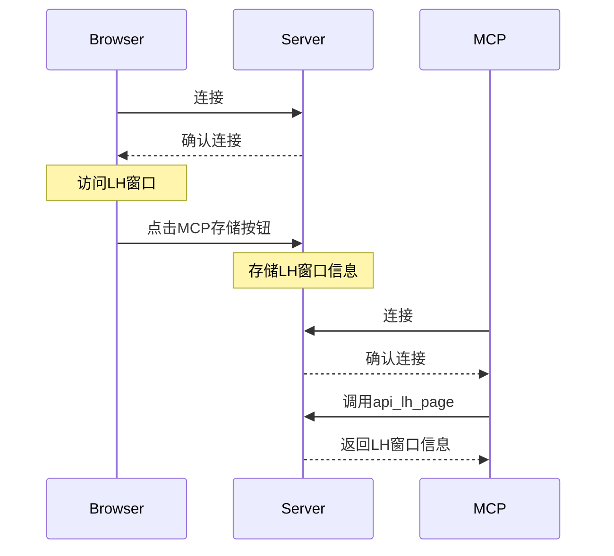

# zha-ai
ai技术

# lh 相关
- 启动client : lh-ai -> 导出MCP存储
- 启动server : `python3 lh-server.py`
- 浏览器端连接server : `ws://localhost:5200`
- mcp:  调用`api_lh_page`获取LH窗口信息
- mcp配置
```json
{
  "mcpServers": {
    "api-util": {
      "command": "node",
      "args": [
        "/Users/ahao/Downloads/zha-ai/project-mcp/dist/index.js"
      ]
    }
  }
}
```

