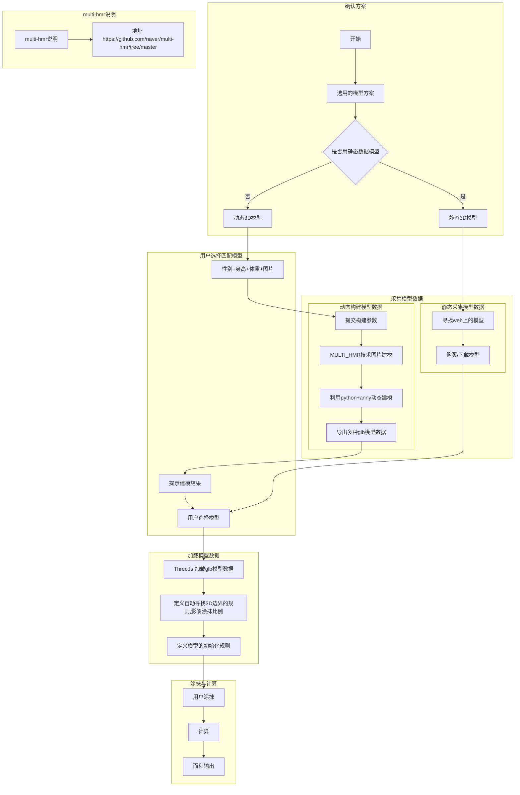

```mermaid
graph TD 
    subgraph 确认方案
    AppStart["开始"]-->ChoosePlan[选用的模型方案]-->PlanType{是否用静态数据模型}
        PlanType --> |是| static-3d-body[静态3D模型]
        PlanType --> |否| dynamic-3d-body["动态3D模型"]
    end
    subgraph 采集模型数据
        subgraph 静态采集模型数据 
            static-3d-body-->A["寻找web上的模型"]-->B[购买/下载模型]
        end
        subgraph 动态构建模型数据
            UserFormCommit-->PythonMultiHMR[MULTI_HMR技术图片建模]-->PythonAnny[利用python+anny动态建模]
            -->PythonAnnyExport["导出多种glb模型数据"]
        
        end
    end

    subgraph 用户选择匹配模型
        dynamic-3d-body-->UserForm[性别+身高+体重+图片]--> UserFormCommit["提交构建参数"]
        PythonAnnyExport-->UserWait["提示建模结果"]
        -->UserSelect["用户选择模型"]
    end
   

    subgraph 用户选择匹配模型
        B-->UserSelect["用户选择模型"]
    end

    subgraph 加载模型数据
        UserSelect-->body_data_load["ThreeJs 加载glb模型数据"]
        -->body_data_range[定义自动寻找3D边界的规则,影响涂抹比例]-->body_data_init[定义模型的初始化规则]
    end

    subgraph 涂抹与计算
        body_data_init-->G["用户涂抹"]-->H["计算"]-->I["面积输出"]
    end


 
   subgraph  multi-hmr说明
       multi-hmr说明[multi-hmr说明]-->地址[地址 https://github.com/naver/multi-hmr/tree/master]
   end
```
