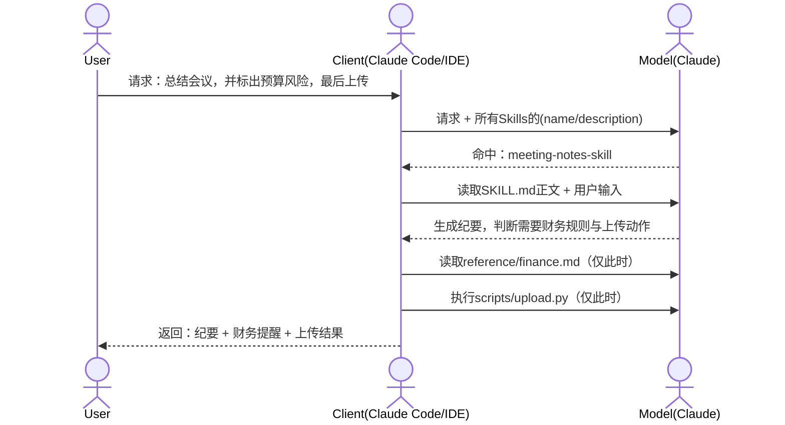
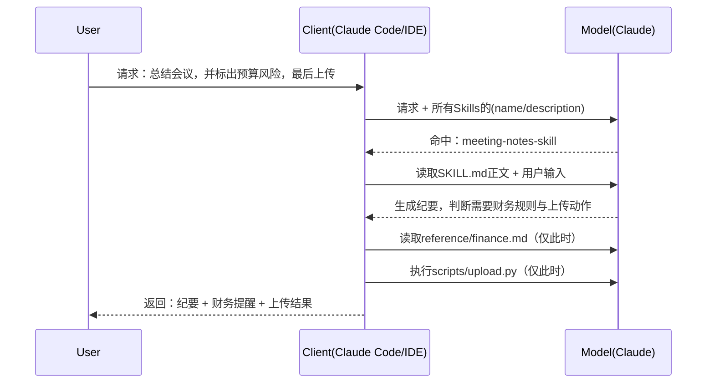

```mermaid
sequenceDiagram
    actor User
    actor Client as Client(Claude Code/IDE)
    actor Model as Model(Claude)

    User->>Client: 请求：总结会议，并标出预算风险，最后上传
    Client->>Model: 请求 + 所有Skills的(name/description)
    Model-->>Client: 命中：meeting-notes-skill
    Client->>Model: 读取SKILL.md正文 + 用户输入
    Model-->>Client: 生成纪要，判断需要财务规则与上传动作
    Client->>Model: 读取reference/finance.md（仅此时）
    Client->>Model: 执行scripts/upload.py（仅此时）
    Client-->>User: 返回：纪要 + 财务提醒 + 上传结果
```

# 用一张图记住它：

```mermaid
sequenceDiagram
    participant User
    participant Client as Client(Claude Code/IDE)
    participant Model as Model(Claude)

    User->>Client: 请求：总结会议，并标出预算风险，最后上传
    Client->>Model: 请求 + 所有Skills的(name/description)
    Model-->>Client: 命中：meeting-notes-skill
    Client->>Model: 读取SKILL.md正文 + 用户输入
    Model-->>Client: 生成纪要，判断需要财务规则与上传动作
    Client->>Model: 读取reference/finance.md（仅此时）
    Client->>Model: 执行scripts/upload.py（仅此时）
    Client-->>User: 返回：纪要 + 财务提醒 + 上传结果
```